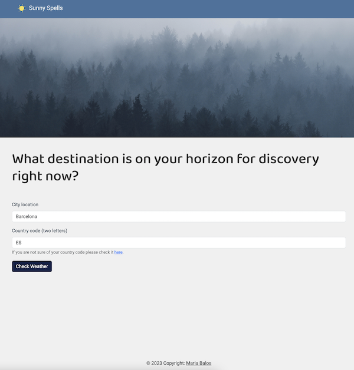
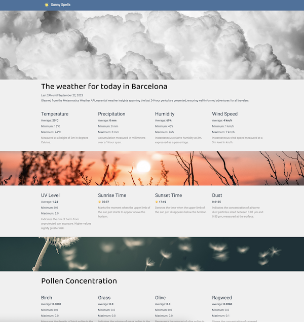

# Sunny Spells
## Introduction

This repository conrtains the code for a Flask app that summarizes weather data for a given location in the last 24h. To do so, it uses the [OpenWeatherMap](https://openweathermap.org/) API to get the coordinates of the city provided and the [Meteomatics](https://www.meteomatics.com/) API to query the weather for the given coordinates. The images used within this project are provided by the [Unsplash](https://unsplash.com/es) website. 

## Geting Started
If you want to run this project in your computer please follow these steps:

1. Clone this repository.
2. Install the requirements: `pip install -r requirements.txt`
3. Request credentials for the specified APIs. 
   1. OpenWetherMap: [link](https://home.openweathermap.org/users/sign_up)
   2. Meteomatics: [link](https://www.meteomatics.com/en/sign-up-weather-api-test-account/)
4. Add the credentials to the `credentials.json` file.
5. Run `python main.py`
   
## Contribution
Please feel free to submit any bug fixes and improvements as a pull request and they will be taken into consideration as soon as I can.
